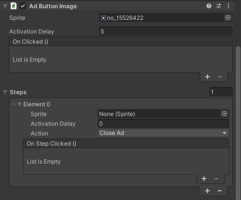

# 🧠 AdButtonImage Component

The `AdButtonImage` component is an interactive image button designed for ads, supporting multiple click steps with different sprites, delays, and actions.

---

## ✅ How to Add AdButtonImage from Hierarchy Menu

1. Right-click in the Hierarchy or use the menu:

```
UI > Magic WebAds > Ad Button Image
```

2. A GameObject named **Ad Button Image** will be created with the necessary components. If no Canvas exists in the scene, a new Canvas will be created automatically and the button will be attached to it.

3. Select the created GameObject to view and edit its properties in the Inspector.

---

## 📸 Screenshot of AdButtonImage Inspector:



---

## 🗂 Inspector Fields

| Field             | Type                 | Description                                                                  |
| ----------------- | -------------------- | ---------------------------------------------------------------------------- |
| `sprite`          | `Sprite`             | The button’s main image displayed on the button.                             |
| `activationDelay` | `float`              | Delay (in seconds) before the button is activated and shown after ad starts. |
| `onClicked`       | `UnityEvent`         | Event triggered every time the button is clicked.                            |
| `steps`           | `List<AdButtonStep>` | Click steps; each step can have its own sprite, delay, and action.           |

---

## 🗂 AdButtonStep Fields (Click Steps)

| Field             | Type             | Description                                                                                 |
| ----------------- | ---------------- | ------------------------------------------------------------------------------------------- |
| `sprite`          | `Sprite`         | New button image for this step; if not set, the button image does not change.               |
| `activationDelay` | `float`          | Delay to disable and then enable the button on this step (if greater than 1 second).        |
| `action`          | `AdButtonAction` | Action performed after the button is clicked (load next ad, close ad, disable button, etc.) |
| `onStepClicked`   | `UnityEvent`     | Event invoked on this click step.                                                           |

---

## 📝 Notes

* All sprite images used **must** have **Read/Write** checked in their import settings to avoid errors.
* It is recommended that the button be a child of the `UIAdView` component for proper functioning.
* Also, make sure to reference the button in the `adButtons` field of the `UIAdView` component via the Inspector.