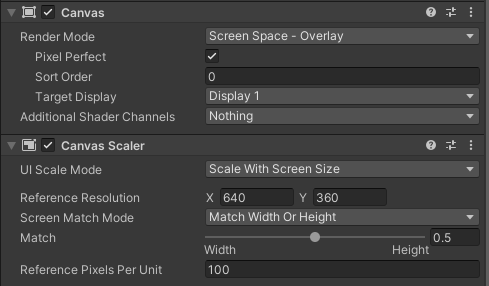

# Canvas Setup for Ads

To properly display WebView ads using Magic WebAds, you need to create a **separate Canvas** dedicated for ads.

---

## ✅ How to Set Up the Ads Canvas

1. In the **Hierarchy** window, add a new **UI Canvas**
2. Select the Canvas and in the **Inspector** window:

   * Set **Render Mode** to **Screen Space - Overlay**
   * Open **Canvas Scaler** and set **UI Scale Mode** to **Scale With Screen Size**
   * Set the **Match** option to **Width Or Height** (e.g., 0.5)
   * Set **Reference Resolution** to **640 x 360**

> ⚠️ These settings and resolution are crucial to perfectly align WebView pixels with HTML/CSS rendering on Android devices.

---

## 🖼 Canvas Inspector Screenshot

---

## 🧩 Next Up:

📄 [Next: UIAdView Component](uiadview.md)