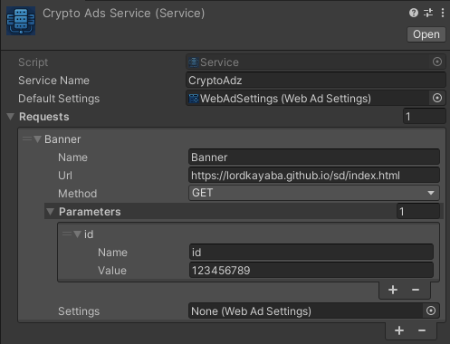

# 🧩 Creating an Ad Service (Service)

In the **Magic WebAds** package, you can create different ad services using `ScriptableObject`s. Each service can include multiple ad requests (WebAdRequest). Here's how to create one.

---

## ✅ Steps to Create a Service

1. Right-click inside the `Project` window  
2. Navigate through:

> `Create > MagicWebAds > Service`

3. A new `ScriptableObject` file will be created  
4. Rename it to something like `CryptoAdsService`  
5. Then select it and configure it through the **Inspector**

---

## 🖼 Full View of the Service Inspector

---

## 🗃 Structure and Service Parameters

| Field                | Type                  | Description                                                             |
|----------------------|------------------------|-------------------------------------------------------------------------|
| `serviceName`        | `string`               | Display name or logical identifier for this ad service                  |
| `defaultSettings`    | `WebAdSettings`        | Shared settings for all ad requests under this service                  |
| `requests`           | `List<WebAdRequest>`   | List of ad requests handled by this service                             |

---

## 🌐 Parameters of Each WebAdRequest

| Field             | Type                  | Description                                                                 |
|--------------------|------------------------|------------------------------------------------------------------------------|
| `name`             | `string`               | Internal name for the request                                                |
| `url`              | `string`               | The target URL where the request will be sent                               |
| `method`           | `RequestMethod`        | HTTP method to use, either `GET` or `POST`                                  |
| `parameters`       | `List<Parameter>`      | Key-value pairs to send with the request                                    |
| `settings`         | `WebAdSettings`        | Optional settings specific to this request (overrides the default if set)   |

---

## 🧩 Parameter Structure (inside each request)

| Field    | Type     | Description                        |
|----------|----------|------------------------------------|
| `name`   | `string` | The name/key of the parameter      |
| `value`  | `string` | The value assigned to that key     |

---

## ➕ Related Guide

To learn how to create and configure the `WebAdSettings` file, visit the related documentation:  
📄 [WebAdSettings Documentation](webadsettings.md)