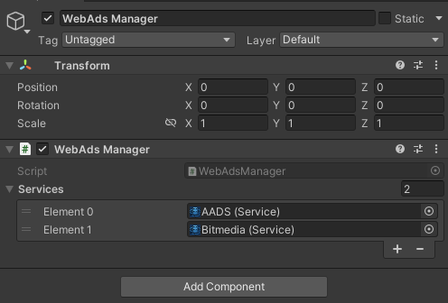

# 🧠 WebAdsManager Component

The `WebAdsManager` is a **singleton component** that clones ad services (`Service` ScriptableObjects) at runtime and manages their ad requests. It also coordinates with UI elements like `UIAdView`.

---

## ✅ How to Add WebAdsManager

To add this component to your scene:

1. Create a **GameObject** (e.g., name it `AdManager`)
2. In the **Inspector**, click `Add Component`
3. Navigate to:

```
Magic WebAds > WebAds Manager
```

4. Add the ad services you created earlier (ScriptableObjects of type `Service`) to the `Services` list in the Inspector
---


## 📸 Screenshot of the WebAdsManager in the Inspector:



---

## 🧩 Key Responsibilities

| Responsibility | Description |
|----------------|-------------|
| Singleton Access | Accessed via the static `Instance` variable |
| Service Cloning | Clones services at runtime to keep project assets untouched |
| Ad Request Management | `GetAdRequests()` filters and returns matching ad requests |
| Ad View Management | Tracks all `UIAdView`s and disposes them on disable |

---

## 🗂 Inspector Fields

| Field | Type | Description |
|-------|------|-------------|
| `services` | `List<Service>` | List of ad service assets that will be cloned at runtime |

---

## 🧩 Next Up:
📄 [Next: Canvas Setup](canvas-setup.md)