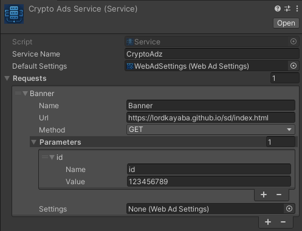

# 🧩 ایجاد سرویس تبلیغاتی (Service)

در پکیج **Magic WebAds**، شما می‌توانید با استفاده از `ScriptableObject`ها، سرویس‌های تبلیغاتی مختلفی ایجاد کنید که هرکدام شامل چندین درخواست تبلیغاتی (Request) هستند. در ادامه مراحل ساخت یک سرویس تبلیغاتی را آموزش می‌دهیم.

---

## ✅ مراحل ایجاد سرویس

۱. در پنجره‌ی `Project` کلیک راست کنید.

۲. مسیر `Create > MagicWebAds > Service` را دنبال کنید.

۳. یک فایل `ScriptableObject` جدید ساخته می‌شود.

۴. نام دلخواه برای سرویس وارد کنید، مثلاً `CryptoAdsService`.

۵. سپس از طریق Inspector، تنظیمات آن را وارد کنید.

---

## 🖼 نمای کلی از سرویس

---

## 🗃 ساختار و پارامترهای سرویس

| ویژگی                | نوع داده             | توضیحات                                                                 |
|----------------------|----------------------|-------------------------------------------------------------------------|
| `serviceName`        | `string`             | نام نمایشی یا شناسه‌ی منطقی برای این سرویس تبلیغاتی                                   |
| `defaultSettings`    | `WebAdSettings`      | تنظیمات پیش‌فرض برای تمام درخواست‌های این سرویس                                    |
| `requests`           | `List<WebAdRequest>` | فهرستی از درخواست‌های تبلیغاتی مرتبط با این سرویس                                    |

---

## 🌐 پارامترهای هر درخواست تبلیغاتی (WebAdRequest)

| ویژگی             | نوع داده             | توضیحات                                                                  |
|--------------------|----------------------|---------------------------------------------------------------------------|
| `name`             | `string`             | نام‌گذاری داخلی برای این درخواست                                                   |
| `url`              | `string`             | آدرس اینترنتی مقصد که درخواست به آن ارسال می‌شود                                     |
| `method`           | `RequestMethod`      | متد ارسال HTTP که می‌تواند `GET` یا `POST` باشد                                     |
| `parameters`       | `List<Parameter>`    | لیستی از پارامترهای دلخواه به صورت جفت کلید-مقدار                                      |
| `settings`         | `WebAdSettings`      | تنظیمات اختصاصی برای این درخواست (در صورت نیاز به تفاوت با پیش‌فرض)                    |

---

## 🧩 ساختار پارامترها (درخواست‌ها)

| ویژگی   | نوع داده | توضیحات                             |
|----------|----------|---------------------------------------|
| `name`   | `string` | نام کلید پارامتر                            |
| `value`  | `string` | مقدار مربوط به آن کلید                      |

---

## ➕ ادامه‌ی آموزش

برای ساخت و تنظیم فایل `WebAdSettings` به مستندات مربوط به آن مراجعه کنید:  
📄 [تنظیمات WebAdSettings](webadsettings.md)

