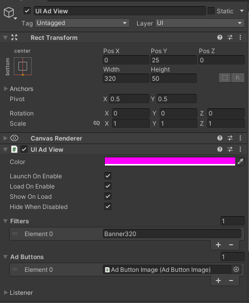

# 🧠 کامپوننت UIAdView

<div dir="rtl">

کامپوننت `UIAdView` برای نمایش تبلیغات داخل Canvas رابط کاربری طراحی شده است و از طریق Inspector قابل تنظیم است.

---

## ✅ نحوه اضافه کردن UIAdView از منوی هایرارکی

1. در ویرایشگر یونیتی به مسیر زیر بروید:

```
GameObject > UI > Magic WebAds > UI Ad View
```

2. یک گیم‌آبجکت با نام **UI Ad View** ساخته می‌شود که کامپوننت‌های لازم روی آن قرار می‌گیرند و به طور خودکار به یک Canvas متصل می‌شود (اگر Canvas وجود نداشته باشد، ایجاد می‌شود).

3. گیم‌آبجکت ساخته‌شده را انتخاب کنید تا تنظیمات آن در Inspector نمایش داده شود.

---

## 🗂 فیلدهای Inspector

| فیلد           | نوع                | توضیح                                                                                  |
|----------------|--------------------|----------------------------------------------------------------------------------------|
| `color`        | `Color`            | فقط در ویرایشگر برای کمک به طراحی و تنظیم ابعاد نمای تبلیغ استفاده می‌شود (در اجرا نمایش ندارد). |
| `launchOnEnable`| `bool`             | اگر فعال باشد، بارگذاری تبلیغ هنگام فعال شدن گیم‌آبجکت شروع می‌شود.                     |
| `loadOnEnable`  | `bool`             | اگر فعال باشد، درخواست تبلیغ هنگام فعال شدن به صورت خودکار بارگذاری می‌شود.             |
| `showOnLoad`    | `bool`             | پس از بارگذاری تبلیغ، به طور خودکار نمایش داده می‌شود.                               |
| `hideWhenDisabled` | `bool`          | در صورت غیرفعال شدن، نمای تبلیغ پنهان می‌شود.                                         |
| `filters`      | `List<string>`     | فیلتر تبلیغات بر اساس نام، فقط تبلیغات مطابق را نمایش می‌دهد.                        |
| `adButtons`    | `List<AdButton>`   | دکمه‌هایی که می‌توانند عملیات روی تبلیغ مثل کلیک یا رد کردن را فعال کنند.           |
| `listener`     | `UIAdListener`     | شامل تمامی callbackهای WebView است.                                                  |

---

## 📸 تصویر Inspector UIAdView:

<p dir="rtl">

</p>

---

## 📝 نکات مهم

- برای محدود کردن تبلیغات، نام فیلترها را در لیست `filters` وارد کنید.
- برای افزودن دکمه‌های تعاملی تبلیغ از `adButtons` استفاده کنید.
- **مهم:** اندازه‌ی `RectTransform` (عرض و ارتفاع) گیم‌آبجکت UI Ad View را برحسب اندازه پیکسلی تبلیغ تنظیم کنید تا تبلیغ به درستی نمایش داده شود و ظاهر مناسبی داشته باشد.

---

## 🧩 آموزش بعدی:

📄 [کامپوننت AdButtonImage](adbuttonimage.md)
</div>