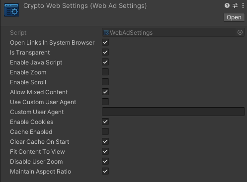

# ⚙️ تنظیمات WebAdSettings

در بسته‌ی Magic WebAds، فایل WebAdSettings یک `ScriptableObject` است که تنظیمات رفتار و ظاهر تبلیغ WebView را مشخص می‌کند. این تنظیمات برای هر درخواست یا سرویس تبلیغاتی قابل اشتراک‌گذاری است.

---

## ✅ مراحل ساخت WebAdSettings

1. کلیک راست در پنجره `Project`
2. مسیر `Create > MagicWebAds > WebAdSettings` را دنبال کنید
3. یک فایل ScriptableObject ساخته می‌شود
4. نام آن را مثلاً بگذارید `CryptoWebSettings`
5. سپس از طریق پنجره **Inspector** تنظیمات دلخواه را انجام دهید

---

## 🖼 تصویر کامل از Inspector

---

## 🗃 جدول پارامترهای WebAdSettings

| نام متغیر              | نوع         | توضیحات                                                                 |
|------------------------|--------------|--------------------------------------------------------------------------|
| `openLinksInSystemBrowser` | `bool`       | باز کردن لینک‌ها در مرورگر پیش‌فرض دستگاه به جای WebView             |
| `isTransparent`        | `bool`       | شفاف بودن پس‌زمینه‌ی WebView در صورت پشتیبانی                         |
| `enableJavaScript`     | `bool`       | فعال‌سازی اجرای JavaScript در WebView                                   |
| `enableZoom`           | `bool`       | امکان بزرگ‌نمایی/کوچک‌نمایی داخل WebView                               |
| `enableScroll`         | `bool`       | فعال کردن اسکرول عمودی و افقی در WebView                               |
| `allowMixedContent`    | `bool`       | اجازه به بارگذاری همزمان HTTP و HTTPS                                  |
| `useCustomUserAgent`   | `bool`       | استفاده از User-Agent سفارشی                                            |
| `customUserAgent`      | `string`     | مقدار رشته‌ی User-Agent سفارشی                                          |
| `enableCookies`        | `bool`       | فعال بودن پشتیبانی از کوکی‌ها                                          |
| `cacheEnabled`         | `bool`       | فعال کردن کش داخلی برای بارگذاری سریع‌تر                              |
| `clearCacheOnStart`    | `bool`       | پاک کردن کش قبل از هر بار بارگذاری تبلیغ                              |
| `fitContentToView`     | `bool`       | مقیاس دادن محتوا به اندازه‌ی دقیق WebView                             |
| `disableUserZoom`      | `bool`       | جلوگیری از زوم کردن دستی کاربر (مثل pinch)                            |
| `maintainAspectRatio`  | `bool`       | حفظ نسبت ابعاد محتوا هنگام مقیاس‌دهی                                  |

---

## 🧩 ادامه‌ی آموزش:
📄 [مرحله‌ی بعد: تنظیمات Canvas تبلیغاتی](canvas-setup.md)

